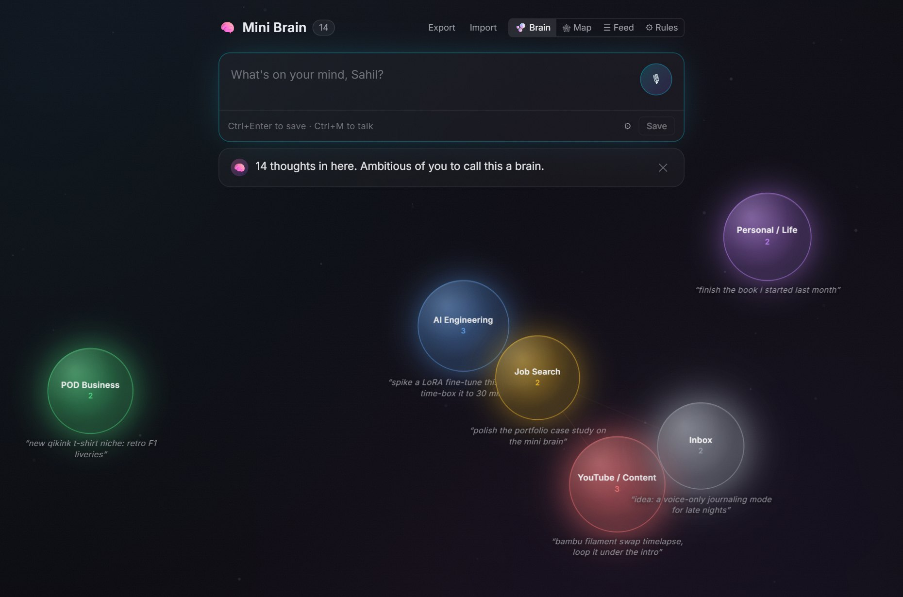
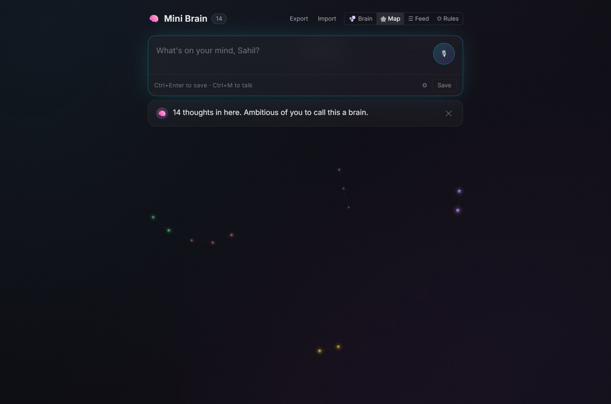
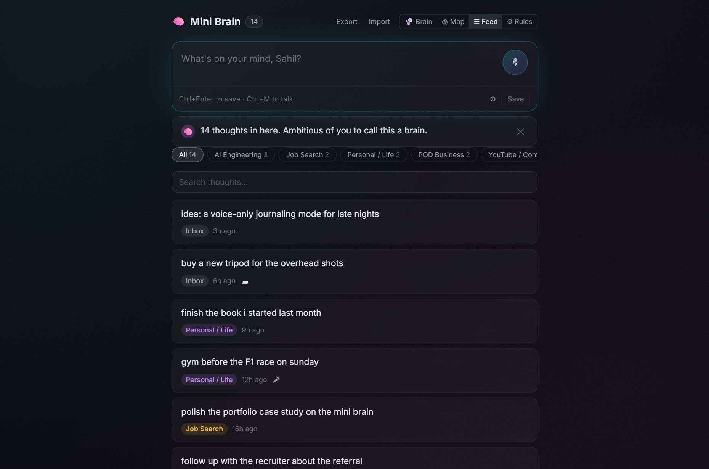
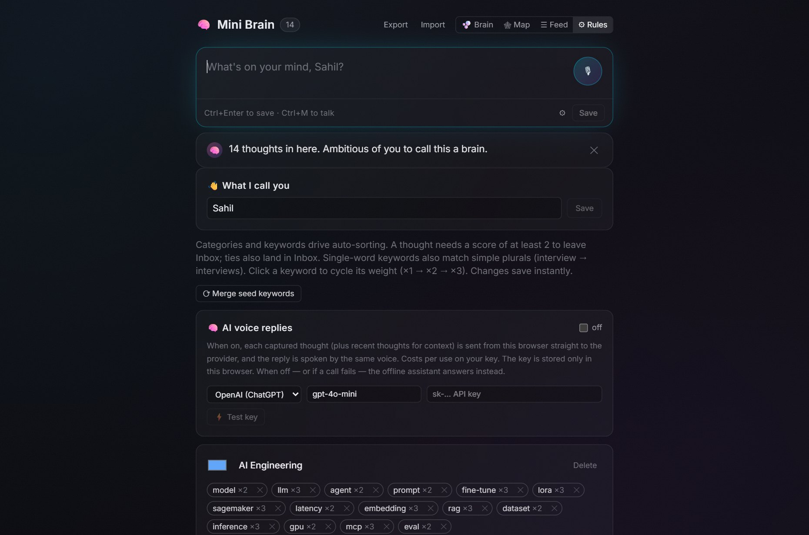
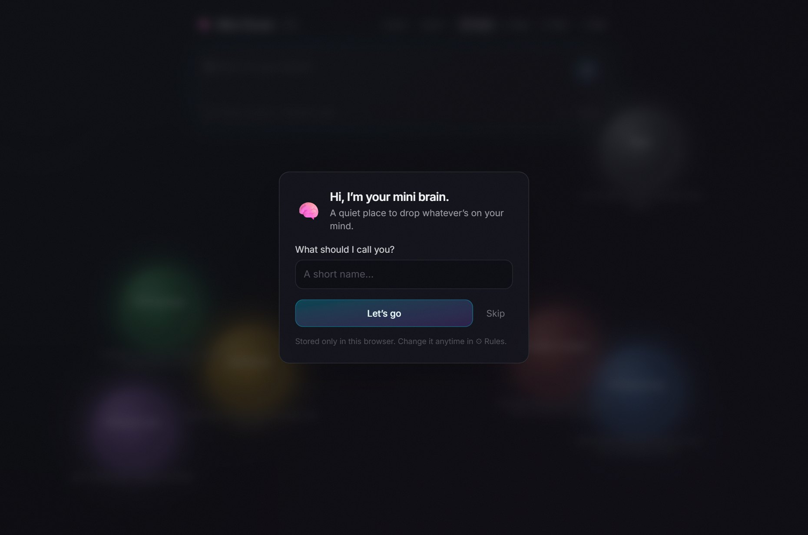

<div align="center">

# 🧠 Mini Brain

**A living, local-first second brain — dump every passing thought by voice or text, and watch it sort itself into a glowing map of your mind.**

No backend. No cloud. No API keys required. Everything runs and persists in your browser.




</div>

---

## Why Mini Brain?

Most note apps make you *file* a thought before you've even finished having it. Mini Brain flips that: you brain-dump — typed or spoken — and an offline engine files it for you, a dry little assistant talks back, and your thoughts drift around the screen as a neural map you can actually *feel*.

It's a portfolio-grade front-end project that happens to be genuinely useful every day.

- 🔒 **Truly local-first & private.** Thoughts live in your browser's IndexedDB and never leave your machine. No server, no account, no tracking. (The two optional features that *can* reach out — AI replies and phone capture — are opt-in and clearly labelled.)
- 🎙️ **Voice both ways.** Talk to it hands-free and it captures every thought after a pause; it talks back in a natural, human female voice — all through the browser's built-in Web Speech API, free.
- ⚡ **Offline keyword categorization.** A typed, unit-tested scoring engine sorts each thought into your categories with zero network calls. Tune the rules live.
- 🧩 **Three ways to see your mind** — floating **Brain** bubbles, an interactive **Map** graph, and a searchable **Feed**.
- 💬 **A brain with a personality.** The assistant greets you by name, welcomes you once a day, and answers each thought with an actionable nudge — offline by rules, or by a real LLM if you opt in.
- 📱 **Capture from anywhere.** A tiny local bridge lets you add thoughts from Telegram (or OpenClaw / WhatsApp) straight into your brain.
- ♿ **Accessible & polished** — keyboard-first, ARIA-labelled, respects `prefers-reduced-motion`, dark by design.
- ✅ **77 unit tests** across the categorization engine, the assistant, voice-selection, and the graph builder.

---

## Features at a glance

### 🫧 Brain — your thoughts, floating
Each category is a glowing orb sized by how much lives inside it, drifting and gently colliding, connected by synapse lines. Recent categories glow brighter; each bubble whispers one of its thoughts so you can scan your mind at a glance. Capturing a thought sends a spark flying into its bubble.


### 🕸 Map — every thought as a synapse
A never-settling force graph where every individual thought is a node, linked by shared category, shared words, `#tags`, and `[[wikilinks]]`. Click any node to fly the camera in, light up its neighbours, and read the full thought.



### ☰ Feed — search and tidy
A reverse-chronological feed with live category filters, instant search, inline edit/delete, one-click re-categorization, and a badge showing how each thought arrived (⌨️ typed, 🎙️ voice, 📨 phone).



### ⚙ Rules — tune the brain
Add categories and weighted keywords, adjust how the assistant sounds, plug in an optional AI key, and set what the brain calls you — all persisted locally.



### 👋 A warm welcome
On first run it asks what you'd like to be called, then greets you once a day thereafter.



---

## How it works

```
┌──────────────┐   type / speak / phone   ┌───────────────────────┐
│  Capture     │ ───────────────────────▶ │  Categorization engine │  pure, unit-tested
│  (voice+text)│                          │  keyword scoring → cat │  keyword weights 1–3
└──────────────┘                          └───────────┬───────────┘
                                                      │
                          ┌───────────────────────────▼───────────────────────────┐
                          │            IndexedDB (Dexie) — your data, local         │
                          └───┬───────────────┬───────────────┬───────────────┬─────┘
                              │               │               │               │
                         🫧 Brain         🕸 Map          ☰ Feed         💬 Assistant
                        (canvas orbs)  (force-graph)   (list + search)  (rules or LLM)
                                                                              │
                                                                     🔊 speechSynthesis
```

- **Categorization** lowercases the thought, matches keywords (word-boundary for single words incl. simple plurals, substring for phrases), sums weights per category, and picks the winner — ties and low scores fall to Inbox.
- **Storage** is Dexie over IndexedDB, so thoughts survive restarts. Export/import to JSON any time.
- **Voice** uses the browser's `webkitSpeechRecognition` (in) and `speechSynthesis` (out) — the voice picker prefers the most natural female voice your browser exposes.
- **The Map** is built on [`force-graph`](https://github.com/vasturiano/force-graph) with a custom canvas renderer and a pure graph-builder.

---

## Tech stack

| | |
|---|---|
| **Framework** | React 18 + TypeScript (strict, no `any`) |
| **Build** | Vite 6 |
| **Styling** | Tailwind CSS v4, dark by default, Inter (bundled, offline) |
| **Storage** | Dexie.js over IndexedDB |
| **Voice** | Web Speech API — `webkitSpeechRecognition` + `speechSynthesis` |
| **Graph** | force-graph (2D canvas) |
| **Tests** | Vitest — 77 passing |
| **Bridge** | Node standard library only (no deps) |

---

## Run it on your machine

**Prerequisites:** [Node.js](https://nodejs.org) 18+ and **Google Chrome or Edge** (the voice features need the Web Speech API).

```bash
git clone https://github.com/ivats2911/mini-brain.git
cd mini-brain
npm install
npm run dev
```

Then open **http://localhost:5173** in Chrome. That's the whole core app — capture, voice, all three views, and the offline assistant work with just this.

### Optional: capture from your phone (Telegram)

In a **second** terminal:

```bash
# Get a bot token from @BotFather on Telegram, then:
export TELEGRAM_BOT_TOKEN="123456:AA..."   # PowerShell: $env:TELEGRAM_BOT_TOKEN="..."
npm run bridge
```

Message your bot from anywhere and the thoughts flow into Mini Brain when it's open. OpenClaw / WhatsApp can push to the same endpoint — see [`docs/phone-capture.md`](docs/phone-capture.md).

### Optional: smarter AI replies

By default the assistant is offline and rule-based. To have it answer conversationally, open **⚙ Rules → AI voice replies**, pick a provider (OpenAI or Anthropic), paste your own API key (stored only in your browser), and hit **Test key**. Any failure falls back to the offline brain.

### Handy scripts

```bash
npm test           # run the 77 unit tests
npm run build      # typecheck (strict) + production build
npm run screenshots # regenerate the README screenshots (needs the dev server up)
```

---

## Data & privacy

Your thoughts are stored in **your browser only** and never sent anywhere by the core app. Use **Export** in the header to download everything (thoughts + rules) as JSON, and **Import** to merge it back. Two features can reach the network, both opt-in and off by default: **AI replies** (sends the thought to your chosen LLM) and the **phone bridge** (runs on `127.0.0.1` only).

---

## Project layout

```
src/
  categorization/   keyword scoring engine (+ tests)
  assistant/        offline reply persona + optional LLM (+ tests)
  graph/            thought-graph builder for the Map (+ tests)
  voice/            speech recognition, synthesis, voice picking (+ tests)
  components/        CaptureCard, BrainView, MapView, Feed, RulesEditor, Onboarding …
  db/               Dexie schema + JSON export/import
server/capture.mjs  dependency-free phone-capture bridge
docs/               setup guides + screenshots
```

See [`CLAUDE.md`](CLAUDE.md) for a deeper architecture tour.

---

<div align="center">
Built with care as a local-first, offline-by-default second brain. 🧠
</div>
